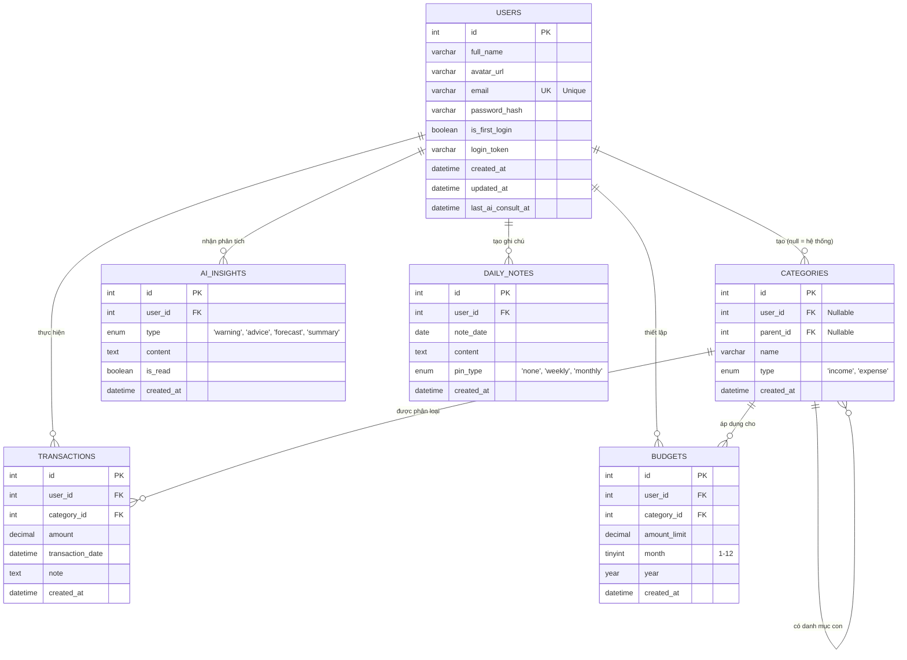

# Sơ đồ Thực thể liên kết (ERD) - Hệ thống CashFlow

Dưới đây là sơ đồ ERD mô tả cấu trúc cơ sở dữ liệu của hệ thống, được vẽ bằng cú pháp Mermaid. Bạn có thể copy mã này dán vào Notion, Obsidian hoặc các trình duyệt hỗ trợ Mermaid (như GitHub, GitLab) để xem trực quan.

