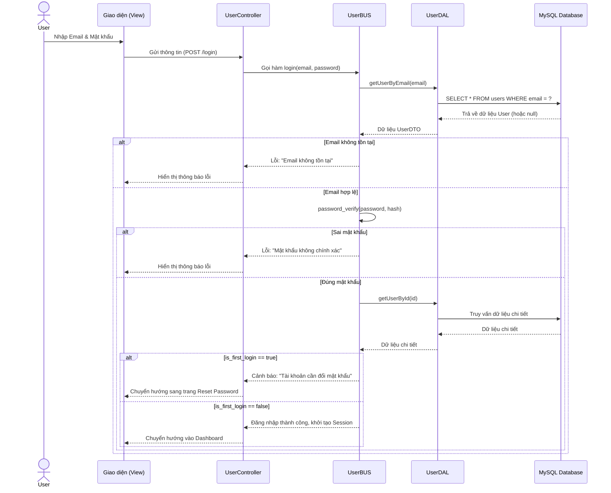
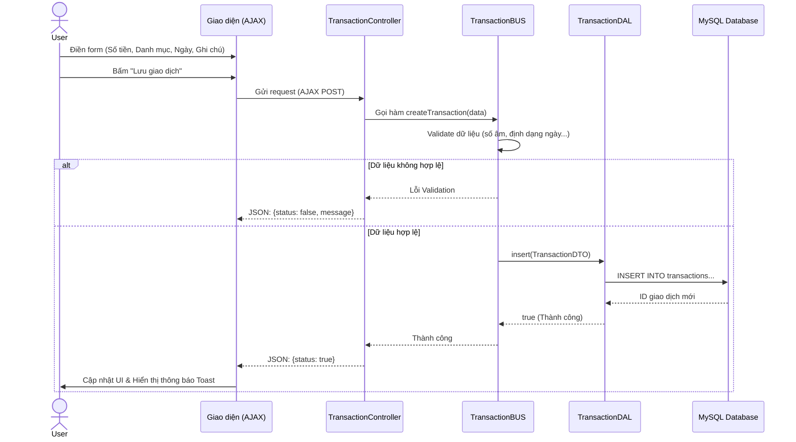
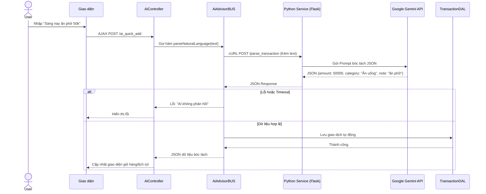
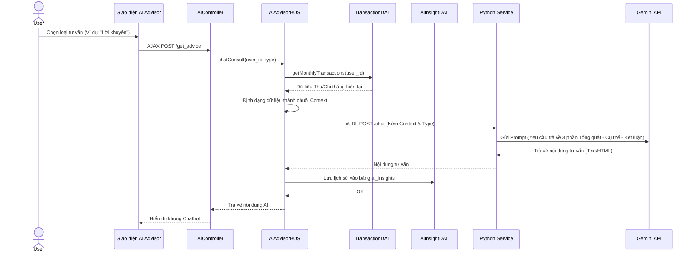

# Các Sơ đồ Tuần tự (Sequence Diagram) - Hệ thống CashFlow

Trong một báo cáo đồ án chuẩn Kỹ thuật Phần mềm (SE), việc vẽ **tất cả** các chức năng nhỏ lẻ (như sửa/xóa từng mục) thường làm báo cáo bị loãng và lặp lại. Thay vào đó, khái niệm "đầy đủ" nên được hiểu là vẽ đủ các **luồng nghiệp vụ cốt lõi và phức tạp nhất** đại diện cho toàn bộ hệ thống.

Dưới đây là 4 sơ đồ Sequence Diagram bao phủ toàn bộ các trụ cột của CashFlow. Bạn có thể copy mã Mermaid này để đưa vào báo cáo.

---

### 1. Luồng Xác thực (Đăng nhập & Kiểm tra thiết lập lần đầu)
Luồng này thể hiện cơ chế kiểm tra bảo mật (Bcrypt) và chuyển hướng người dùng nếu họ đăng nhập lần đầu qua email.

---

### 2. Luồng Ghi chép Giao dịch Thủ công (CRUD cơ bản)
Đại diện cho kiến trúc 3 lớp tiêu chuẩn khi tương tác với CSDL.

---

### 3. Luồng AI Quick Add (Bóc tách dữ liệu bằng NLP)
Luồng giao tiếp đa dịch vụ: **PHP Backend <-> Python AI Service <-> Google Gemini**.

---

### 4. Luồng AI Advisor (Cố vấn Tài chính)
Thể hiện cách hệ thống tổng hợp dữ liệu làm "Ngữ cảnh" (Context) cho AI.

